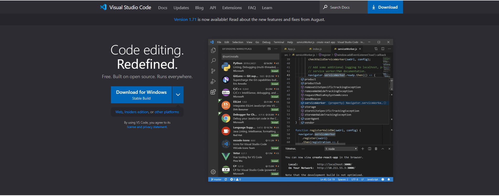
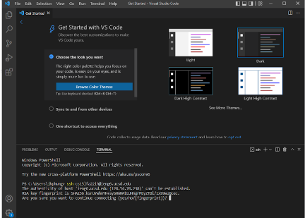
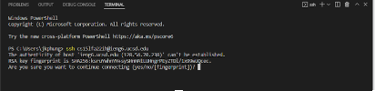
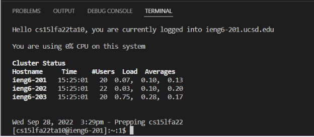
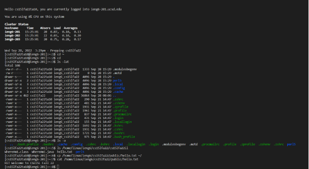
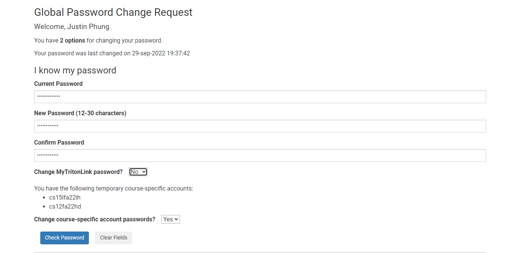
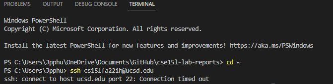

## Instaling VScode
To get started, we have to first install VSCode. To do so click on this link, [https://code.visualstudio.com/](https://code.visualstudio.com/), 
which will take you to the website to download VSCode. You should end up on the page shown below, make sure to download the correct version for 
the system that you're running, whether it be Windows, Mac, or Linux. 

Afterwards when you're down installing, open up VScode. It should look like the image shown below.

## Remotely Connecting
Now that we're down installing VScode, we want to connect to the remote servers. Before we run any commands, make sure you have OpenSS **client** 
installed, and **ONLY OpenSS Client**, not OpenSS server. He is a link for the instructions to do so, [Install OpenSS](https://learn.microsoft.com/en-us/windows-server/administration/openssh/openssh_install_firstuse?tabs=gui).

Once you have done so, create a new terminal. This is done so by selecting **Terminal** at the top and selecting **New Terminal**.
Put it this command, $ ssh cs15lfa22**zz**@ieng6.ucsd.edu, with the zz being replaced with you last two letters of you course account. 
This can be found under this [link](https://sdacs.ucsd.edu/~icc/index.php) when signing in. The image below showcases the prompt that will
show up when signing in for the first time, type in yes and it will prompt the password you use for your UCSD account

This is what it should look like when successfully logging in, as it will connect you to one of the three remote machines on campus.

## Trying Some Commands
Now that we have successfuly logged in, try out these some of these commands and observe what they do. 
1. cd ~
2. cd
3. ls -lat
4. ls -a
5. ls <directory> where <directory> is /home/linux/ieng6/cs15lfa22/cs15lfa22abc, where the abc is one of the other group members’ username
6. p /home/linux/ieng6/cs15lfa22/public/hello.txt ~/
7. cat /home/linux/ieng6/cs15lfa22/public/hello.txt

Some have been already disscused in lecture, and other have not. Here's the list of all the commands inputed within the terminal

## Errors with logging with ssh

This is the part where I ran out of time. While I was able to do parts of the lab with the usage of a TA's account, I was unable to finish 
due to much time spent on trying to figure out how to login in to my actual account. The images above showcase the steps I took to trying 
to resolve the issue, but unfortunately with no success. Restarting the global password with this [link](https://sdacs.ucsd.edu/~icc/index.php) 
for my UCSD account a couple times. However, I also ran into another issue, in which I wasn't able to connect to the server of remote machines 
from home.

Hopeful the issue is resolved for future assignments.
