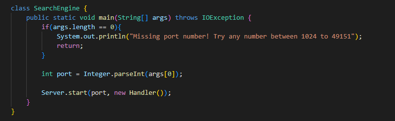
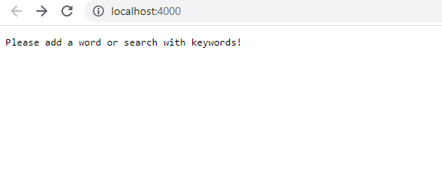
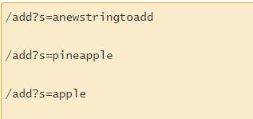
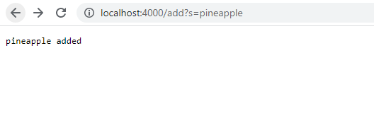

# Part 1: Making the Simplest Search Engine

---

## Setting up the Sever

Here is the implementation of a web server, which allows us to track a list of strings creating a path for *adding* a new string 
to a list, and another path for *querying* the list of strings to presenting all the strings within an array with a given substring.
Here is a link to the code for creating this web server. [SearchEngine.java](https://github.com/Awakenight/wavelet/blob/master/SearchEngine.java)

First off, we start with setting up the server which is done so with the code down below:

This allows use to create a web server when we start implementing code to the main method, so that we can access through it through 
the terminal. Notice before we implemented our class, **Handler**, and main method, **handleRequest(URI url)**, we imported **java.net.URI**.
This allows for the Handler to implement URLHandler to set up urls to create. After running the commands javac Server.java SearchEngine.java,
and java SearchEngine 4000, we can vist the web sever that we created, which the image showcases the message we initially set up. 

## Adding strings to a list 

To start adding strings to the list we inputed the added following paths/queries to the url:

The image below showcases the message that pops up when inputing one of these paths/queries to indicate the we have added 
to the list of strings we created with the following path **/add**.

