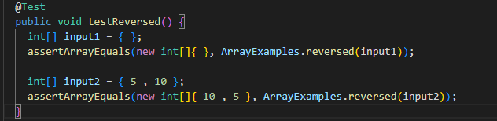
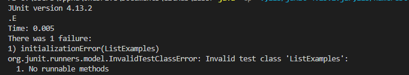

# Part 1: Making the Simplest Search Engine

---

## Setting up the Sever

Here is the implementation of a web server, which allows us to track a list of strings creating a path for *adding* a new string 
to a list, and another path for *querying* the list of strings to presenting all the strings within an array with a given substring.
Here is a link to the code for creating this web server. [SearchEngine.java](https://github.com/Awakenight/wavelet/blob/master/SearchEngine.java)

First off, we start with setting up the server which is done so with the code down below:

This allows use to create a web server when we start implementing code to the main method, so that we can access through it through 
the terminal. Notice before we implemented our class, **Handler**, and main method, **handleRequest(URI url)**, we imported **java.net.URI**.
This allows for the Handler to implement URLHandler to set up urls to create. After running the commands javac Server.java SearchEngine.java,
and java SearchEngine 4000, we can vist the web sever that we created, which the image showcases the message we initially set up. 

## Adding strings to a list 

To start adding strings to the list we inputed following paths/queries to the url:

The image below showcases the message that pops up when inputing one of these paths/queries to indicate the we have added 
to the list of strings we created with the following path **/add**, along with what string we want to add within the query
after "?s=".

The code below shows how the path **/add**, implements the function of adding strings to a list:

1. **if (url.getPath().contains("/add"))**, checks if the path **/add** was inputed to the url:
2. **String[] parameters = url.getQuery().split("=")**, splits the query into two parts, the first part being "s" which 
is a placeholder for the query which represents string, and the second part being the actual string we want to add to the list.
3. **if (parameters[0].equals("s")) { words.add(0, parameters[1]); return parameters[1] + " added"; }**, adds the second part 
of the query which we split, adding to an ArrayList of type String that we initialized before the method. Along with printing 
out the message of adding te string to the list, which the image above showcases. 

## Searching for Strings with given SubString 

To create a list of strings with a given substring within the web sever, we inputed following paths/queries to the url. In which
this example we are checking for the strings with the substring **"app"**. Notice within the image below how the strings 
"apple" and "pineapple" are within the list, but NOT **"anewstringtoadd"** since it doesn't contain the substring **"app"**.

The code below shows how the path **/search**, implements the function of creating a list of strings with given substring:

1. **String[] parameters = url.getQuery().split("=")**, splits the query into two parts, the first part being "s" which 
is a placeholder for the query which represents string, and the second part being the actual string we want to add to the list.
2. **ArrayList<String> chosenWords = new ArrayList<String>()**, is the ArrayList created to add the strings with the given substring.
3. **if (parameters[0].equals("s"))**, checks for the first part of the query before checking the list of strings.
4. **for (int i = 0; i < words.size(); i++)**, iterates throughout the list of strings added by the path **/add**.
5. **if (words.get(i).contains(parameters[1]))**, checks for the given substring or second part of the query within each string.
6. **chosenWords.add(0, words.get(i))**, adds to the ArrayList with all the strings with given substring when if statment is met.
7. **return chosenWords.toString()**, creates a list of words with given substring as a message within the web server, which 
the image above showcases.

# Part 2: Debugging

---

## ArrayExamples.java, reversed(int[] arr)

Failure-inducing input: An array with integers {5, 10}.

Symptom: Returned an array with list of only zeros.

Bug: arr[i] = newArray[arr.length - i - 1]; should instead be, newArray[i] = arr[arr.length - i - 1];
and the method should return newArray instead of arr.

The connection between the symptom and the bug is that due to the bug, if you were to input one or more 
non-zero integers within the array, it will always output an arry with the same size but with all zeros.
This is due to the elements for newArray being copied over to the inputed arr, in which there are only 
integers of zero with the newArray.  

## ListExamples.java, filter(List<String> list, StringChecker sc)

Failure-inducing input: Trying to input StringChecker object into method

Symptom: Initialization error for ListExamples

Bug: A potential class error when implementing StringChecker's abstract method checkString(String s) when 
intializing ListExamples.

The connection between the symptom and the bug is that due to the bug, when trying to test an input 
of the StringChecker object, it is unable to do so due to StringChecker's abstract method not being 
implemented properly. Therefore, when initializing the StringChecker object to ListExamples, it produces
the error of "No runnable methods."