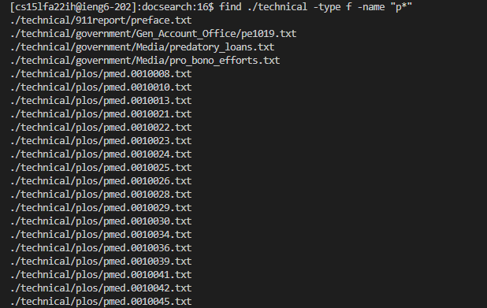
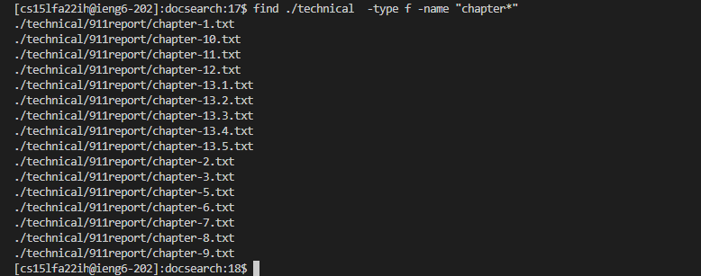
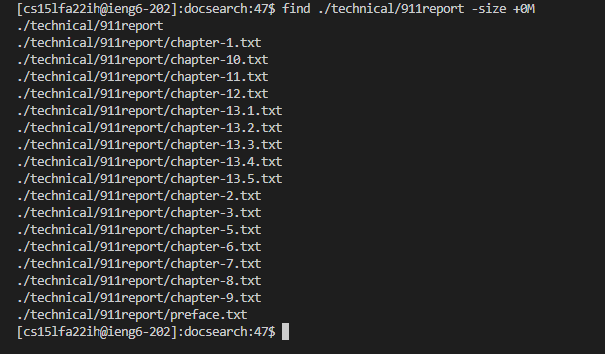
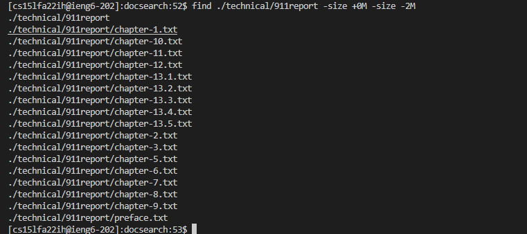
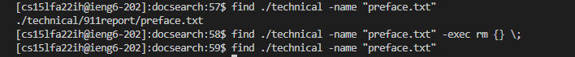
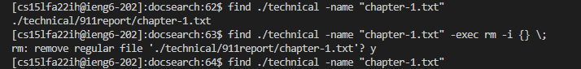

# Week 5 Lab Report: Find Command Options

---

## Command option 1: find . type

The command option find .type has a few options, two of which are to find either a 
**file** or **subdirectory** based on the current directory that you're in.

1. find . type f - finds all files 

2. find . type d - finds all subdirectories

This can be useful when paired with the find option, -name, to look for specific files 
and subdirectories as shown in the examples below.

The example above showcases finding a subdirectory within the directory, technical. By specificing
that we're looking for only subdirectories whose name starts with **p** within -name, we find only 
on subdirectory that fits the conditions set. 

The example above is similar to the first example, as find names that start with **p**. However, we
changed our **type d** to be **type f**. Therefore, we're looking for only files within the directory,
technical, whose names start with **p**, rather than subdirectories. 

The example above searches for files wihtin the directory, technical, whose type is specified as files 
with **type f**. The specific files that we're searching are those with names that start with **chapter**,
specified by the command **-name "chapter*"**.

## Command option 2: find -size

The command option find -size finds all the files within the directory based on the input parameter of
meagabyte or gigabyte. **M** for meaga bytes, and **G** for gigabytes. You can also add in a **+** or **-** 
sign to indicate if the file that you're searching for is greater than, **+**, or less than, **-**, 
the sized files you want to find.

This is useful for finding files that potential take up more space than they should, and either modifying,
or deleting them to create more space. 

The example above showcases trying to find files with the size of 20 megabytes within the directory, technical
There exists none that meets the condition, therefore, when inputing the command into the command line, it produces nothing.

The example above showcases how to incorporate the **+** sign  to the command option find -size. In which
we sepecify that we're looking for files that are greater than 0 megabytes. Since all the files are within
**./technical/911report** are greater than 0 megabytes, all the files under that subdirectroy
are listed out when inputing the command.

The example above showcases how to find files within a specific range of size. We specific within the command that
we're looking for files greater than 0 megabytes, **-size +0M**, but less than 2 megabytes, **-size -2M**. 
Since all the files are within **./technical/911report** meet those conditions we set, all the files under 
that subdirectroy are listed out when inputing the command.

# Command option #3: find -exec rm {} \;

1. -exec: Executes a posterior command after the first command (find) execution.

2. rm: This command is used to remove of files and directories matching the given names.

3. {}: This is the find command placeholder, for it takes the file or directory names given 
to the find command to run the given command (After –exec) on them.

4. \;: The back slash and the semicolon finishes the –exec.

This command is useful to find specific files and delete.

The example above showcases pairing the remove command with the size command, as we remove all files with
size 2M within the path **./technical/911report**. However, since there are no files that have size 2M,
none of the files are removed.

The example above showcases how we we specific a specific file to be deleted. The file named **pre-face.txt**,
within the directory, technical, is removed. Notice how before we removed the file, we were able to find the file
with the command **find ./technical -name "preface.txt"**. However after we delete the file, **find ./technical -name "preface.txt"**
no longer produced the output **./technical/911report/preface.txt**.

The example above is similar to the second example in which we specific a specific file. The file named **chapter-1.txt**,
within the directory, technical, is removed. However, before it is removed we are prompted to confirm whether or not we
want to remove the files that we have found, to which we type in Y/y if we want to. 
