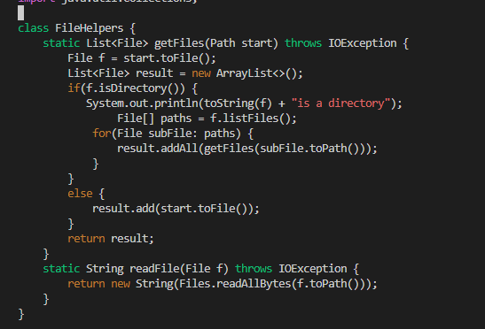
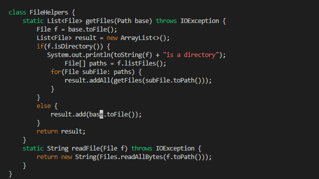
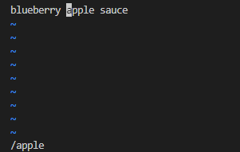
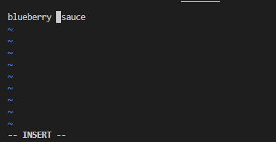
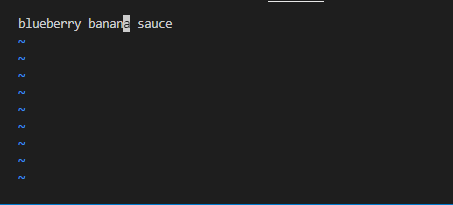
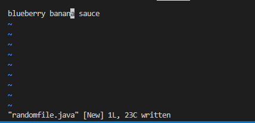

# Week 7 Lab Report

---

## Part 1: Editing from the Command Line

Here are the instructions on how I changed the name of the **start** parameter and its uses to **base** 
within the method **getFiles**, under the file **DocSearchSever.java**, using vim.

Enter the command `vim DocSearchServer.java` and have your cursor start at top, before the method,
**getFiles**. You should start in normal mode, however, press `<Esc>` to make sure that you're in normal mode. 
Below is the list of keys to press to chang the name of the **start** parameter and its uses to **base**. 
Along with images of what the method looks like before and after. 

`/start<Enter>cebase<Esc>n.n.:w<Enter>`

Before: 

After:

Here is an explaination on changing the first occurrence of the word “apple” to “banana” in a file containing 
**blueberry apple sauce**, using vim with the following keys: 

`/apple<Enter>cebanana<Esc>:w<Enter>`

**/apple<Enter>** allows for you to search for text after **/**, which moves your cursor in front
of the first instance of the text:

**ce**  allows for your to delete the text and switch to insert mode:

**banana<Esc>** replaces the text by inputing the word **banana**, and 
**<Esc>** returns you back to normal mode:

**:w<Enter** saves the changes made to the file:

## Part 2: Editing Styles for Remote Servers

1st Style:
Once, start in Visual Studio Code and make the edit there, then **scp** the file to the remote server and run it there 
to confirm it works (you can just run **bash test.sh** on the remote to test it out). Consider having the appropriate 
**scp** command in your command history or easily copy-pasteable!

Time - 1.30 min.
Difficulties - Retyping the password to login to the remote ssh server, and writing our the scp command to copy
the file to the correct directory.

2nd Style:
Second, start already logged into a **ssh** session. Then, make the edit for the task you chose in Vim, 
then exit Vim and run **bash test.sh**.

Time - 35 sec.
Difficulties - Figuring our the correct keys to press when navigating and editing files in vim

---

Out of the two styles, I would prefer the 2nd style to edit files and work on programs that are running remotely,
due to it being easier to navigate through. I might write in the wrong directory when copying over files from
local to remote, and if a mistake were to occur, I'll have to go back to the local file and copy it over again.

However, if there is a lot of testing and editing to be done, I would prefer the other style as editing directly
in VScode or any other program writing software would be easier than using vim and trying to remember all the shortcuts.