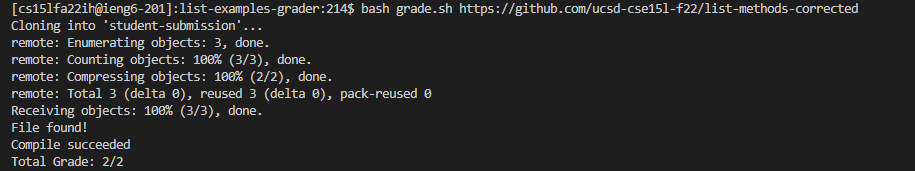
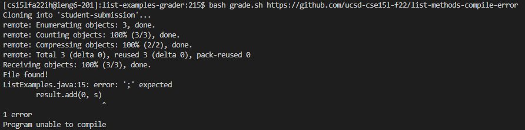
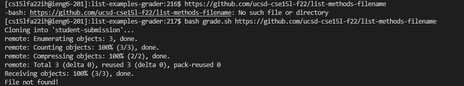

# Week 9 Lab Report

---

## Grading Script 

```

CPATH=".:../lib/hamcrest-core-1.3.jar:../lib/junit-4.13.2.jar"
TotalGrade=2
file="ListExamples.java"

rm -rf student-submission
git clone $1 student-submission
cp TestListExamples.java student-submission/
cd student-submission

if [[ -f $file ]]
then
    echo "File found!"
else
    echo "File not found!"
    exit 1
fi

javac -cp $CPATH *.java

if [[ $? -eq 0 ]]
then
    echo "Compile succeeded"
else
    echo "Program unable to compile"
    exit 2
fi

java -cp $CPATH  org.junit.runner.JUnitCore TestListExamples > errors.txt

if [[ $(grep -c "testFilter(TestListExamples)" errors.txt) -eq 1 ]]
then
     ((TotalGrade-=1))
    let "TotalGrade-=1"
    echo "[FAILED 0/1] testFilter"
fi

if [[ $(grep -c "testMerge(TestListExamples)" errors.txt) -eq 1 ]]
then
    ((TotalGrade-=1))
    let "TotalGrade-=1"
    echo "[FAILED 0/1] testMerge"
fi

echo Total Grade: $TotalGrade/2

```

The bash script above was used to grade the sample student submmissions down below.

[https://github.com/ucsd-cse15l-f22/list-methods-corrected](https://github.com/ucsd-cse15l-f22/list-methods-corrected), 
which has the methods corrected (Would expect this to get full or near-to-full credit):


[https://github.com/ucsd-cse15l-f22/list-methods-compile-error](https://github.com/ucsd-cse15l-f22/list-methods-compile-error), 
which has a syntax error of a missing semicolon. 


[https://github.com/ucsd-cse15l-f22/list-methods-filename](https://github.com/ucsd-cse15l-f22/list-methods-filename), 
which has a great implementation saved in a file with the wrong name.


The sample student submission that my grading script ran through, that I'll be going over is 
[https://github.com/ucsd-cse15l-f22/list-methods-filename](https://github.com/ucsd-cse15l-f22/list-methods-filename),
the image right above.

Lines that ran
1. rm -rf student-submission: 
*standard output* - removes any files/directories labeled "student-submission"
*return code* - 0

2. git clone $1 student-submission: 
*standard output* - copies the student repository into a created directory labeled student-submission. 
Shown within the terminal is "Cloning into 'student-submission'..." to the line tha ends with "done".
*return code* - 0

3. cp TestListExamples.java student-submission/:
*standard output* - copies file over to the directory
*return code* - 0

4. cd student-submission:
*standard output* - shifts the directory 
*return code* - 0

5. if [[ -f $file ]] 
*standard output* - if statement returns false and prints out to the terminal "Program unable to compile"
*standard error* - doesn't find the name of file
*return code* - 1

Since if [[ -f $file ]] return code ends up being 1, we exit out of the bash script with the command `exit 1`.
Therefore the rest of the if statments don't run since there're after the exit command, along with the rest of
the lines

Lines that didn't run:
1. if [[ $? -eq 0 ]] - checks if file compiled.

2. java -cp $CPATH  org.junit.runner.JUnitCore TestListExamples > errors.txt - redirects standard output to file.

3. if [[ $(grep -c "testFilter(TestListExamples)" errors.txt) -eq 1 ]] - tests filter method and checks for return code 1
or standard error, to deduct points.

4. if [[ $(grep -c "testMerge(TestListExamples)" errors.txt) -eq 1 ]] - tests merge method and checks for return code 1
or standard error, to deduct points.

5. echo Total Grade: $TotalGrade/2 - prints out grade to student. 
